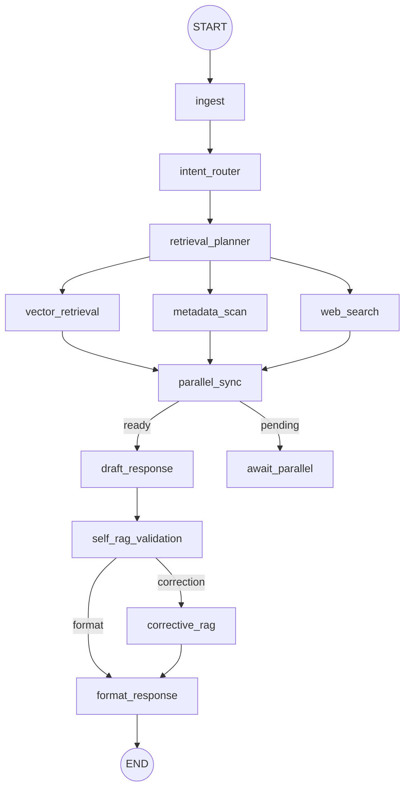

# LangGraph 병렬·Self-RAG 워크플로 (Consumer 전용)

Itdaing 챗봇은 LangGraph 1.0.3의 병렬 분기와 조건부 에지를 이용해 벡터 검색, 메타데이터 샘플, Synthetic 웹 업데이트를 동시에 수행한 뒤 Self-RAG 루프로 품질을 보강합니다. 본 문서는 Guardrail/Seller 흐름을 제거한 최신 구성을 요약합니다.

## 1. 상위 단계 요약

| 단계           | 노드                                              | 목적/특징                                                                |
| -------------- | ------------------------------------------------- | ------------------------------------------------------------------------ |
| 입력 정규화    | `ingest`                                          | 질의를 정리하고 공백을 제거                                              |
| 의도/Smalltalk | `intent_router`                                   | Smalltalk/정체성 질문 감지 → `special_response`, `bypass_retrieval` 설정 |
| Retrieval 계획 | `retrieval_planner`                               | `vector`, `metadata`, `web` 태스크 목록 구성 (Smalltalk 시 빈 목록)      |
| 병렬 Retrieval | `vector_retrieval`, `metadata_scan`, `web_search` | LangGraph 병렬 실행, `completed_tasks` 업데이트                          |
| 동기화         | `parallel_sync` + `await_parallel`                | 모든 태스크 완료 시 초안 단계로 이동                                     |
| 초안           | `draft_response`                                  | 소비자 템플릿 기반 1차 응답 작성                                         |
| Self-RAG       | `self_rag_validation`                             | coverage/미흡 facet 계산, 부족 시 `needs_correction=True`                |
| Corrective-RAG | `corrective_rag`                                  | 부족 facet을 쿼리에 추가해 재검색                                        |
| 최종 포맷      | `format_response`                                 | Smalltalk/Correction 여부를 통합해 응답 반환                             |

## 2. 상태 정의 (발췌)

```python
class ChatbotState(TypedDict, total=False):
    query: str
    special_response: str
    bypass_retrieval: bool
    retrieval_tasks: List[str]
    completed_tasks: Annotated[List[str], extend_unique]
    evidence: Annotated[Dict[str, Any], merge_dicts]
    insights: Annotated[Dict[str, Any], merge_dicts]
    context_items: List[Dict[str, Any]]
    draft_response: str
    validation: Dict[str, Any]
    needs_correction: bool
    parallel_ready: bool
    response: str
```

- `extend_unique`, `merge_dicts` 커스텀 병합 함수로 병렬 분기 간 상태 충돌을 방지합니다.
- Smalltalk가 감지되면 Retrieval 단계 전체를 우회합니다.

## 3. 병렬 분기 동작

1. `retrieval_planner`가 `retrieval_tasks`를 계산 (`vector` + `metadata` 기본, 웹 키워드 시 `web`).
2. 세 노드를 `StateGraph.add_edge`로 동시에 실행합니다.
3. 각 노드는 완료 시 `_mark_completed`로 자신의 태스크 ID를 추가하고, 결과를 `evidence`/`insights`에 병합합니다.
4. `parallel_sync`는 `set(completed_tasks) >= set(retrieval_tasks)`이면 `parallel_ready=True`를 반환합니다.
5. 조건부 에지에서 `ready` → `draft_response`, `pending` → `await_parallel`. `await_parallel` 노드는 상태를 유지한 채 다른 분기가 끝나기를 기다립니다.

## 4. Self-RAG & Corrective-RAG

- `self_rag_validation`은 초안, 컨텍스트, 쿼리를 바탕으로 `coverage`와 `missing_facets`를 계산합니다. 야간/프리미엄 등 필수 키워드가 빠지면 실패로 간주합니다.
- 실패 시 `route_after_validation`이 `corrective_rag`로 분기하고, 부족한 facet을 쿼리에 붙여 다시 `recommend`를 실행합니다.
- 재검색 후 `insights["corrections"]`와 `validation`을 업데이트하고 포맷팅 단계로 이동합니다.

## 5. Smalltalk 우회 흐름

- `intent_router`는 `SMALLTALK_KEYWORDS` 목록으로 자기소개/정체성 질문을 감지합니다.
- Smalltalk일 경우 `special_response`만 채우고 `bypass_retrieval=True`로 설정합니다.
- 이후 Retrieval/병렬/Self-RAG 노드는 빈 작업을 반환하며 최종 응답은 준비된 안내 멘트를 그대로 사용합니다.

## 6. 시각화



## 7. 향후 확장 포인트

- `web_search` 노드를 Tavily/OpenAPI 호출로 교체하고 실패 시 Synthetic fallback 제공
- `metadata_scan`에 상권 혼잡도/편의시설 점수 계산을 추가해 필터링 근거 강화
- `corrective_rag` 반복 실행 허용(현재 1회 제한)
- LangGraph Inspector 출력과 Mermaid를 동기화해 회귀 테스트 시 그래프 변화를 추적
