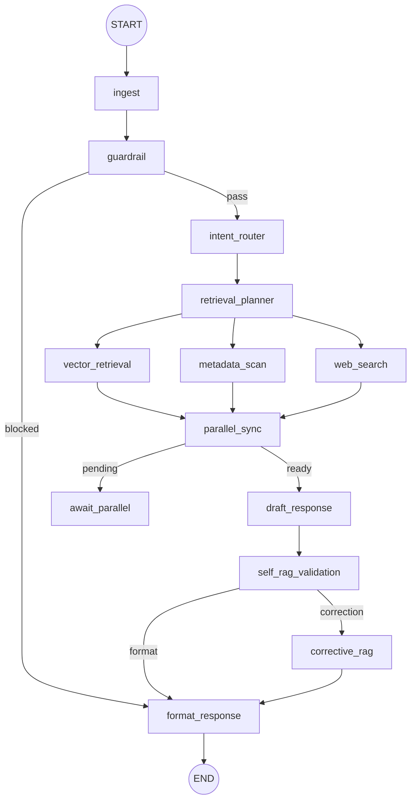

# LangGraph 1.0 병렬·Self-RAG 워크플로

Itdaing 챗봇은 LangGraph 1.0.3 기능(`START`, 병렬 분기, 조건부 에지, Annotated 병합 정책)을 활용해 병렬 Retrieval + Self-RAG 파이프라인을 구성합니다. 본 문서는 실제 그래프 구성을 빠르게 파악할 수 있도록 노드·상태·동작을 요약합니다.

## 1. 상위 단계 요약
| 단계 | 노드 | 목적/특징 |
|------|------|-----------|
| 입력 정규화 | `ingest` | 공백 제거, 기본 역할 계산 (`_detect_role`) |
| 정책 검증 | `guardrail` | 광주 외 요청/시스템 프롬프트 노출 등 차단 |
| 의도/역할 | `intent_router` | 판매자/소비자 판별 + Smalltalk 감지(`special_response`, `bypass_retrieval`) |
| Retrieval 계획 | `retrieval_planner` | `vector`, `metadata`, `web` 태스크 목록 구성 (Smalltalk 시 빈 목록) |
| 병렬 Retrieval | `vector_retrieval`, `metadata_scan`, `web_search` | LangGraph 병렬 실행, 완료 시 `completed_tasks` 업데이트 |
| 동기화 | `parallel_sync` + `await_parallel` | 모든 태스크가 끝나야 초안 단계 이동 |
| 초안 | `draft_response` | role별 템플릿, Smalltalk이면 미리 준비한 문구 사용 |
| Self-RAG | `self_rag_validation` | coverage/미흡 facet 계산, 부족 시 `needs_correction=True` |
| Corrective-RAG | `corrective_rag` | 부족 facet을 쿼리에 추가해 재검색 |
| 최종 포맷 | `format_response` | Guardrail/Smalltalk/Correction 결과를 통합해 응답 반환 |

## 2. 상태 정의 (발췌)
```python
class ChatbotState(TypedDict, total=False):
    role: Literal["consumer", "seller"]
    query: str
    special_response: str
    bypass_retrieval: bool
    guardrail_triggered: bool
    guardrail_reason: str
    retrieval_tasks: List[str]
    completed_tasks: Annotated[List[str], extend_unique]
    evidence: Annotated[Dict[str, Any], merge_dicts]
    insights: Annotated[Dict[str, Any], merge_dicts]
    context_items: List[Dict[str, Any]]
    draft_response: str
    validation: Dict[str, Any]
    needs_correction: bool
    parallel_ready: bool
    response: str
```
- `extend_unique`, `merge_dicts` 커스텀 병합 함수로 병렬 분기 간 상태 충돌을 방지합니다.
- Smalltalk 또는 Guardrail이 트리거되면 Retrieval 단계 전체를 우회합니다.

## 3. 병렬 분기 동작
1. `retrieval_planner`가 `retrieval_tasks`를 계산 (`vector` 필수, `metadata` 기본, 웹 키워드 시 `web`).
2. `StateGraph.add_edge`를 통해 세 노드가 동시에 실행됩니다.
3. 각 노드는 작업 완료 시 `_mark_completed`로 자신의 태스크 ID를 `completed_tasks`에 추가하고, 결과를 `evidence`/`insights`에 병합합니다.
4. `parallel_sync`는 `set(completed_tasks) >= set(retrieval_tasks)` 일 때 `parallel_ready=True`를 반환합니다.
5. 조건부 에지에서 `ready` → `draft_response`, `pending` → `await_parallel`. `await_parallel` 노드는 상태를 그대로 유지하며 미완료 분기를 기다립니다.

## 4. Self-RAG & Corrective-RAG
- `self_rag_validation`은 초안, 컨텍스트, 쿼리를 바탕으로 `coverage`와 `missing_facets`를 계산합니다. 야간/프리미엄/셀러 키워드가 누락되면 실패로 간주합니다.
- 실패 시 `needs_correction=True`가 되어 `route_after_validation`이 `corrective_rag`로 분기합니다.
- `corrective_rag`는 누락된 facet을 쿼리에 붙여 다시 `recommend`/`guide` 함수를 실행하고, `insights["corrections"]`에 보강 여부를 기록한 뒤 포맷팅으로 이동합니다.

## 5. Smalltalk & Guardrail 우회 흐름
- `intent_router`는 `SMALLTALK_KEYWORDS` 목록을 통해 자기소개/정체성 질문을 감지합니다.
- Smalltalk일 경우 `special_response`에 안내 멘트를 저장하고 `bypass_retrieval=True`로 설정합니다.
- 이후 `retrieval_planner`, 병렬 Retrieval, Self-RAG 노드는 모두 빈 작업을 받아 사실상 건너뛰며, `draft_response`와 `format_response`에서 해당 문장을 그대로 반환합니다.

## 6. 시각화
Mermaid 다이어그램 (LangGraph Inspector에서 보는 구조와 동일):


## 7. 향후 확장 포인트
- `web_search` 노드를 실제 Tavily/Open API 호출로 교체하고, 실패 시 Synthetic fallback 제공
- `metadata_scan`을 확장해 존 혼잡도/편의시설 점수 계산을 추가
- `insights` dict에 Self-RAG 평가 지표와 Guardrail 사유를 함께 기록해 모니터링 파이프라인으로 전송
- `corrective_rag` 반복 실행 허용: 현재는 한 번만 수행하지만 필요 시 while 루프 형태로 확장 가능

